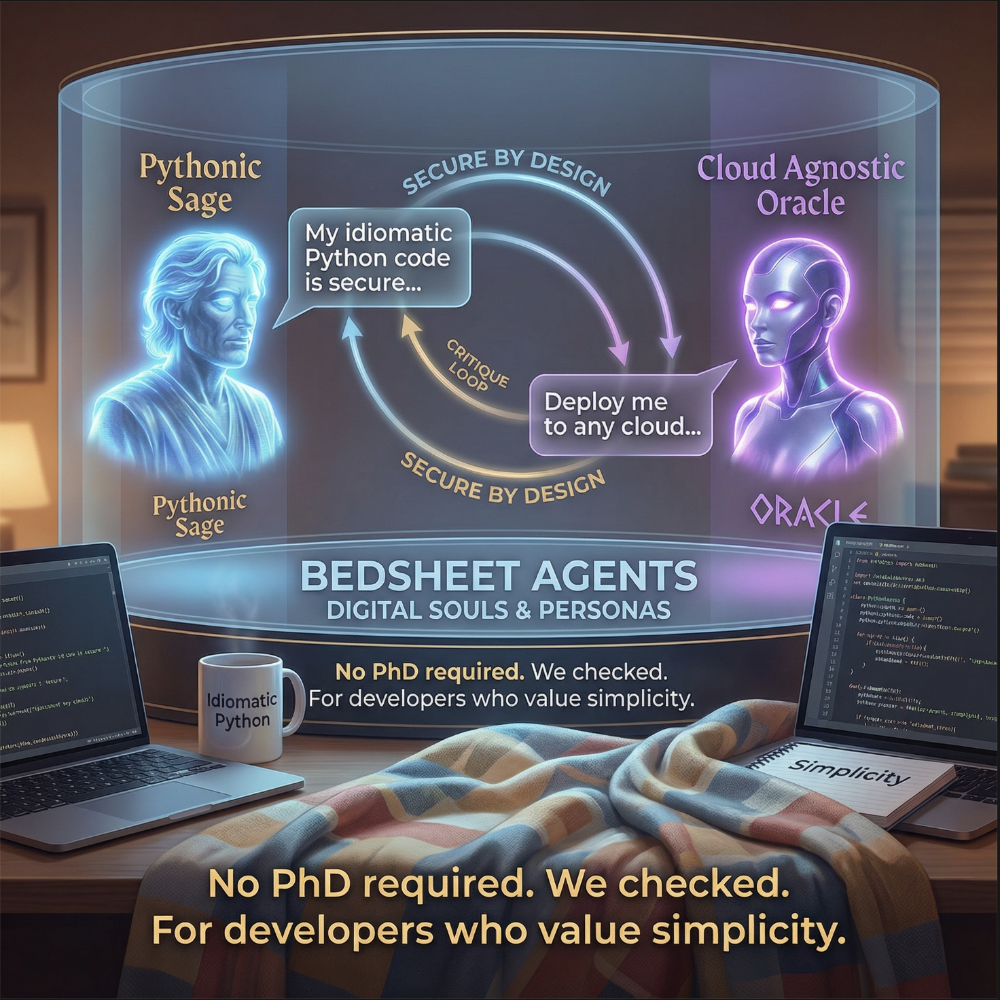

<p align="center">
  
</p>

<p align="center">
  <!-- <i>No PhD required. We checked.</i>
  <br>
  <i>For developers who value simplicity.</i>
  --> 
</p>

<p align="center">
  <a href="https://www.python.org/downloads/"></a>
  <a href="https://www.elastic.co/licensing/elastic-license"></a>
  
</p>

**Cloud-agnostic AI agent framework for Python.** Build agents that actually do things, coordinate multi-agent teams, and see what's happening inside.

---

## Quick Start (60 seconds)

```bash
export ANTHROPIC_API_KEY=sk-ant-...
uvx bedsheet demo  # Run demo instantly, no install needed
```

**A research assistant in 20 lines:**

```python
import asyncio
from bedsheet import Agent, ActionGroup
from bedsheet.llm import AnthropicClient
from bedsheet.events import CompletionEvent

# Give your agent a superpower
tools = ActionGroup(name="Research")

@tools.action(name="search", description="Search for information")
async def search(query: str) -> str:
    # Your real implementation here (API calls, database, etc.)
    return f"Found 3 results for '{query}': ..."

# Create the agent
agent = Agent(
    name="Researcher",
    instruction="You help users find information. Use the search tool.",
    model_client=AnthropicClient(),
)
agent.add_action_group(tools)

# That's it. Use it.
async def main():
    async for event in agent.invoke("session-1", "What's new in Python 3.12?"):
        if isinstance(event, CompletionEvent):
            print(event.response)

asyncio.run(main())
```

**Want the fancy demo?**
```bash
pip install bedsheet[demo]  # Installs yfinance + ddgs for REAL DATA
uvx bedsheet demo           # Multi-agent investment advisor with parallel execution
```

<details>
<summary>📺 <b>See demo output</b> (click to expand)</summary>

```
============================================================
  BEDSHEET AGENTS - Investment Advisor Demo
  *** REAL DATA EDITION ***
============================================================

  This demo uses REAL DATA:
  - Stock data: Yahoo Finance (live prices)
  - News: DuckDuckGo (current articles)
  - Technical analysis: Calculated from real history

User: Analyze NVIDIA stock for me

[3.9s] PARALLEL DELEGATION - dispatching 2 agents:
        -> MarketAnalyst: Analyze NVDA stock data and technicals
        -> NewsResearcher: Find and analyze news about NVIDIA

[18.2s] || [MarketAnalyst] Starting...
        [MarketAnalyst] -> get_stock_data({'symbol': 'NVDA'})
        [MarketAnalyst] -> get_technical_analysis({'symbol': 'NVDA'})
        [MarketAnalyst] <- {'symbol': 'NVDA', 'price': 184.61, ...}

[18.2s] || [NewsResearcher] Starting...
        [NewsResearcher] -> search_news({'query': 'NVIDIA'})
        [NewsResearcher] -> analyze_sentiment({'articles': [...]})

[18.2s] OK [MarketAnalyst] Complete
[18.2s] OK [NewsResearcher] Complete

FINAL RESPONSE (32.3s)
------------------------------------------------------------
# NVIDIA (NVDA) Comprehensive Stock Analysis

## Executive Summary
NVIDIA shows **strong bullish signals** across both technical
indicators and fundamental news sentiment...
```

All data is **REAL** - no mocks, no simulations. Prices from Yahoo Finance, news from DuckDuckGo.

</details>

---

## Why "Bedsheet"?

A playful jab at **AWS Bedrock Agents**. We "cover" the same concepts (agents, action groups, orchestration) but you define everything in **code**, not through a web console with 15 screens and a 3-minute deployment cycle.

Like a bedsheet fits any bed regardless of brand, Bedsheet fits any cloud—or no cloud at all.

*Also, agent frameworks shouldn't take themselves too seriously. The robots aren't sentient yet.*

---

## The Problem

After years of building with existing frameworks:

| Framework | Experience |
|-----------|------------|
| **LangChain** | 400 pages of docs. Still confused. "Hello world" = 47 lines. |
| **AWS Bedrock** | Click. Wait. Click. Wait. Change one word. Repeat for eternity. |
| **AutoGPT** | Agent "researched" by opening 200 browser tabs. RIP laptop. |
| **CrewAI** | 2 hours configuring "crew dynamics". Agents still fighting. |

**Bedsheet's philosophy:**

```python
# This is the entire mental model
async for event in agent.invoke(session_id, user_input):
    print(event)  # See everything. Debug anything. Trust nothing.
```

---

## Features

### Single Agent + Tools

```python
tools = ActionGroup(name="Math")

@tools.action(name="calculate", description="Do math")
async def calculate(expression: str) -> float:
    return eval(expression)  # Don't actually do this in production

agent = Agent(
    name="Calculator",
    instruction="Help with math. Use the calculate tool.",
    model_client=AnthropicClient(),
)
agent.add_action_group(tools)
```

### Multi-Agent Teams

The good stuff. A **Supervisor** coordinates specialized agents:

```python
from bedsheet import Supervisor

researcher = Agent(name="Researcher", instruction="Research topics.", ...)
writer = Agent(name="Writer", instruction="Write clearly.", ...)

supervisor = Supervisor(
    name="ContentTeam",
    instruction="""Coordinate content creation:
    1. Have Researcher gather info
    2. Have Writer create the piece
    Synthesize the final result.""",
    model_client=AnthropicClient(),
    collaborators=[researcher, writer],
)
```

### Parallel Execution

Why wait for agents one-by-one?

```python
# In supervisor instruction:
# "Delegate to BOTH agents simultaneously..."

delegate(delegations=[
    {"agent_name": "MarketAnalyst", "task": "Get stock data"},
    {"agent_name": "NewsResearcher", "task": "Find news"}
])

# Both run at the same time
# Sequential: 4 seconds → Parallel: 2 seconds
```

### Event Streaming

See everything happening inside:

```python
async for event in agent.invoke(session_id, user_input):
    match event:
        case ToolCallEvent(tool_name=name):
            print(f"Calling: {name}")
        case DelegationEvent(delegations=d):
            print(f"Delegating to: {[x['agent_name'] for x in d]}")
        case CompletionEvent(response=r):
            print(f"Done: {r}")
        case ErrorEvent(error=e):
            print(f"Oops: {e}")  # At least you know what broke
```

### Two Modes

| Mode | What It Does | Use When |
|------|--------------|----------|
| `supervisor` | Coordinates agents, synthesizes results | Complex tasks |
| `router` | Picks one agent, hands off completely | Simple routing |

### Structured Outputs (v0.3+)

**Guarantee** your agent returns valid JSON matching your schema. Uses Anthropic's native constrained decoding—the model literally cannot produce invalid output.

```python
from bedsheet.llm import AnthropicClient, OutputSchema

# Option 1: Raw JSON schema (no dependencies)
schema = OutputSchema.from_dict({
    "type": "object",
    "properties": {
        "symbol": {"type": "string"},
        "recommendation": {"type": "string", "enum": ["buy", "sell", "hold"]},
        "confidence": {"type": "number", "minimum": 0, "maximum": 1},
    },
    "required": ["symbol", "recommendation", "confidence"]
})

# Option 2: Pydantic model (if you prefer)
from pydantic import BaseModel

class StockAnalysis(BaseModel):
    symbol: str
    recommendation: str
    confidence: float

schema = OutputSchema.from_pydantic(StockAnalysis)

# Use with any LLM call
client = AnthropicClient()
response = await client.chat(
    messages=[{"role": "user", "content": "Analyze NVDA"}],
    system="You are a stock analyst.",
    output_schema=schema,  # 100% guaranteed valid JSON
)

# Access the validated data
print(response.parsed_output)  # {"symbol": "NVDA", "recommendation": "buy", "confidence": 0.85}
```

**Key points:**
- ✅ Works WITH tools (unlike Google ADK which disables tools with schemas)
- ✅ Pydantic is optional—raw JSON schemas work fine
- ✅ Uses Anthropic's beta `structured-outputs-2025-11-13` under the hood
- ✅ Zero chance of malformed JSON—constrained at token generation

---

## Real Example: Todo Assistant

Something actually useful:

```python
import asyncio
from bedsheet import Agent, ActionGroup
from bedsheet.llm import AnthropicClient
from bedsheet.events import CompletionEvent, ToolCallEvent

todos = []  # Use a real database

tools = ActionGroup(name="Todos")

@tools.action(name="add_todo", description="Add a todo item")
async def add_todo(task: str, priority: str = "medium") -> dict:
    todo = {"id": len(todos) + 1, "task": task, "priority": priority, "done": False}
    todos.append(todo)
    return todo

@tools.action(name="list_todos", description="List all todos")
async def list_todos() -> list:
    return todos

@tools.action(name="complete_todo", description="Mark todo as done")
async def complete_todo(todo_id: int) -> dict:
    for t in todos:
        if t["id"] == todo_id:
            t["done"] = True
            return t
    return {"error": "Not found"}

assistant = Agent(
    name="TodoBot",
    instruction="Manage the user's todo list. Be helpful and concise.",
    model_client=AnthropicClient(),
)
assistant.add_action_group(tools)

async def main():
    queries = [
        "Add a task: Buy milk",
        "Add: Call mom, high priority",
        "What's on my list?",
        "Done with the milk!",
    ]
    for q in queries:
        print(f"\nYou: {q}")
        async for event in assistant.invoke("user-1", q):
            if isinstance(event, CompletionEvent):
                print(f"Bot: {event.response}")

asyncio.run(main())
```

---

## Installation

```bash
# Recommended: Use uv for fast, reliable installs
uv pip install bedsheet           # Basic
uv pip install bedsheet[redis]    # + Redis memory backend
uv pip install bedsheet[dev]      # + Development tools

# Or run directly without installing
uvx bedsheet --help
```

**Requirements:** Python 3.11+ and an [Anthropic API key](https://console.anthropic.com/)

---

## Architecture

```
bedsheet/
├── agent.py          # Single agent (189 lines)
├── supervisor.py     # Multi-agent coordination (362 lines)
├── action_group.py   # Tool definitions (115 lines)
├── events.py         # Event types (105 lines)
├── llm/
│   ├── base.py       # LLM protocol
│   └── anthropic.py  # Claude implementation
└── memory/
    ├── in_memory.py  # Development
    └── redis.py      # Production

Total: ~1,000 lines. Coffee break reading.
```

---

## Comparison

| | Bedsheet | LangChain | AWS Bedrock | CrewAI |
|---|---|---|---|---|
| **Lines of code** | ~1,000 | ~100,000+ | N/A | ~10,000 |
| **Time to understand** | 1 afternoon | 1 week | 2 days | 3 days |
| **Debugging** | print() works | Good luck | CloudWatch | Logs |
| **Streaming events** | Built-in | Add-on | Limited | Limited |
| **Parallel execution** | Default | Manual | Manual | Manual |
| **Cloud lock-in** | None | None | AWS | None |

---

## Documentation

- **[User Guide](https://sivang.github.io/bedsheet/user-guide.html)** — Beginner to advanced, 12 lessons
- **[Technical Guide](https://sivang.github.io/bedsheet/technical-guide.html)** — Python patterns explained
- **[Deployment Guide](https://sivang.github.io/bedsheet/deployment-guide.html)** — Local, GCP, and AWS deployment
- **[GCP Deployment Deep Dive](https://sivang.github.io/bedsheet/gcp-deployment-deep-dive.html)** — GCP architecture, troubleshooting, and best practices
- **[Multi-Agent Guide](https://sivang.github.io/bedsheet/multi-agent-guide.html)** — Supervisor deep dive
- **[Multi-Agent Patterns](https://sivang.github.io/bedsheet/multi-agent-patterns.html)** — Swarms, Graphs, Workflows, A2A

---

## Roadmap

- [x] v0.1 — Single agents, tools, streaming
- [x] v0.2 — Multi-agent, parallel delegation
- [x] v0.3 — Structured outputs
- [x] v0.4 — Deploy anywhere (Local/GCP/AWS), Debug UI, E2E tested ✅
  - v0.4.7: Credential preflight checks, project consistency validation, `make ui` command
- [ ] v0.5 — Knowledge bases, RAG, custom UI examples
- [ ] v0.6 — Guardrails, safety (classification models for high-speed validation)
- [ ] v0.7 — GCP Agent Engine, A2A protocol
- [ ] v0.8 — WASM/Spin support (browser agents, edge deployment, Fermyon Cloud)

---

## Contributing

```bash
git clone https://github.com/sivang/bedsheet.git
cd bedsheet
uv pip install -e ".[dev]"
pytest -v  # 265 tests, all green
```

See [CONTRIBUTING.md](CONTRIBUTING.md) for guidelines.

---

## FAQ

**Production ready?**
Yes. 265 tests, type hints, async-first, Redis support. We use it.

**Only Claude?**
For now. `LLMClient` is a protocol—implement it for OpenAI/Gemini/local. PRs welcome.

**Why not LangChain?**
Life is short.

**Is the name a joke?**
Yes. The code isn't.

---

## License

Elastic License 2.0 - see [LICENSE](LICENSE.md) for details.

---

<p align="center">
<b>Copyright © 2025-2026 Sivan Grünberg, Vitakka Consulting</b>
<br><br>
<sub>Star if it helped. Issue if it didn't. Either way, we're listening.</sub>
</p>
