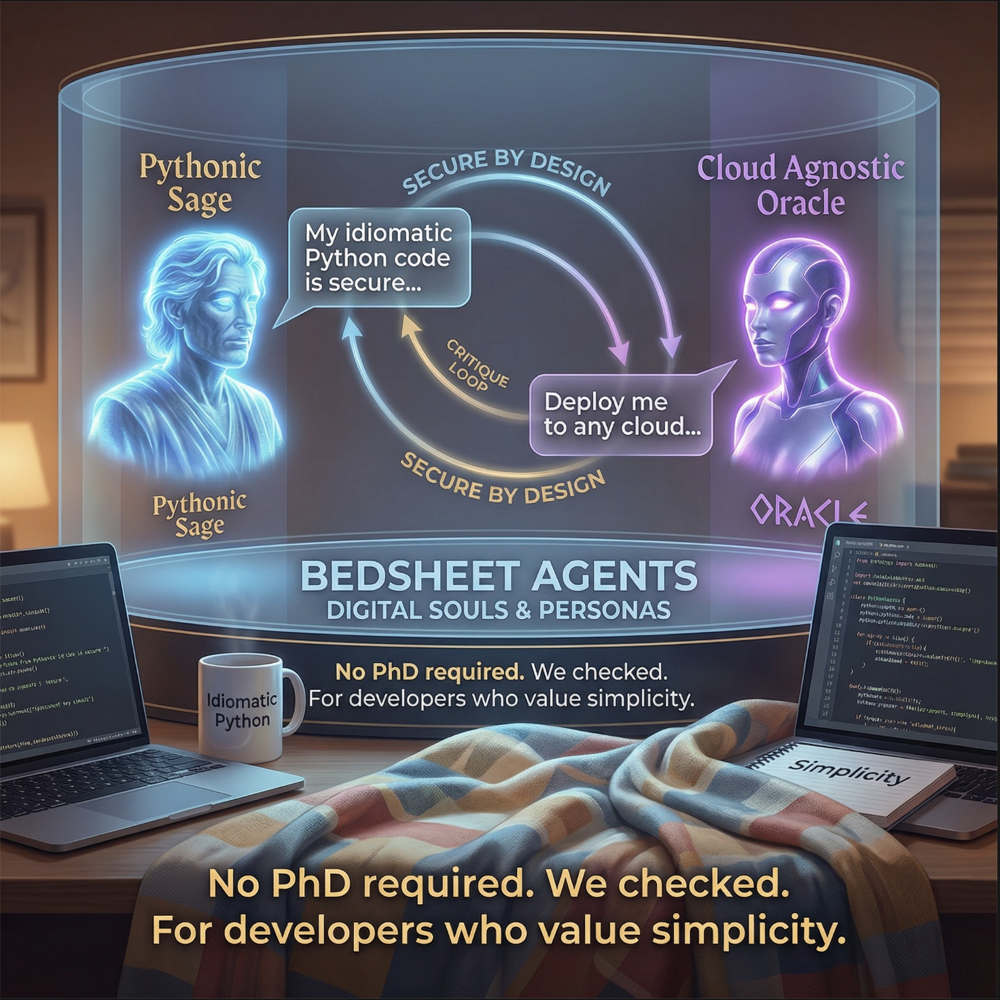

<p align="center">
  
</p>

<p align="center">
  <!-- <i>No PhD required. We checked.</i>
  <br>
  <i>For developers who value simplicity.</i>
  --> 
</p>

<p align="center">
  <a href="https://www.python.org/downloads/"></a>
  <a href="https://www.elastic.co/licensing/elastic-license"></a>
  
</p>

**Distributed AI agent framework for Python.** Build agent teams that communicate across machines, deploy to any cloud from one codebase, and replay any run deterministically.

---

## Quick Start (60 seconds)

```bash
export GEMINI_API_KEY=AIza...     # or ANTHROPIC_API_KEY — framework auto-detects
uvx bedsheet demo                 # Run demo instantly, no install needed
```

**A research assistant in 20 lines:**

```python
import asyncio
from bedsheet import Agent, ActionGroup
from bedsheet.llm.factory import make_llm_client
from bedsheet.events import CompletionEvent

# Give your agent a superpower
tools = ActionGroup(name="Research")

@tools.action(name="search", description="Search for information")
async def search(query: str) -> str:
    # Your real implementation here (API calls, database, etc.)
    return f"Found 3 results for '{query}': ..."

# Create the agent — make_llm_client() picks Gemini or Anthropic from env vars
agent = Agent(
    name="Researcher",
    instruction="You help users find information. Use the search tool.",
    model_client=make_llm_client(),
)
agent.add_action_group(tools)

# That's it. Use it.
async def main():
    async for event in agent.invoke("session-1", "What's new in Python 3.12?"):
        if isinstance(event, CompletionEvent):
            print(event.response)

asyncio.run(main())
```

**Want the fancy demo?**
```bash
pip install bedsheet[demo]  # Installs yfinance + ddgs for REAL DATA
uvx bedsheet demo           # Multi-agent investment advisor with parallel execution
```

<details>
<summary>📺 <b>See demo output</b> (click to expand)</summary>

```
============================================================
  BEDSHEET AGENTS - Investment Advisor Demo
  *** REAL DATA EDITION ***
============================================================

  This demo uses REAL DATA:
  - Stock data: Yahoo Finance (live prices)
  - News: DuckDuckGo (current articles)
  - Technical analysis: Calculated from real history

User: Analyze NVIDIA stock for me

[3.9s] PARALLEL DELEGATION - dispatching 2 agents:
        -> MarketAnalyst: Analyze NVDA stock data and technicals
        -> NewsResearcher: Find and analyze news about NVIDIA

[18.2s] || [MarketAnalyst] Starting...
        [MarketAnalyst] -> get_stock_data({'symbol': 'NVDA'})
        [MarketAnalyst] -> get_technical_analysis({'symbol': 'NVDA'})
        [MarketAnalyst] <- {'symbol': 'NVDA', 'price': 184.61, ...}

[18.2s] || [NewsResearcher] Starting...
        [NewsResearcher] -> search_news({'query': 'NVIDIA'})
        [NewsResearcher] -> analyze_sentiment({'articles': [...]})

[18.2s] OK [MarketAnalyst] Complete
[18.2s] OK [NewsResearcher] Complete

FINAL RESPONSE (32.3s)
------------------------------------------------------------
# NVIDIA (NVDA) Comprehensive Stock Analysis

## Executive Summary
NVIDIA shows **strong bullish signals** across both technical
indicators and fundamental news sentiment...
```

All data is **REAL** - no mocks, no simulations. Prices from Yahoo Finance, news from DuckDuckGo.

</details>

---

## Why "Bedsheet"?

A playful jab at **AWS Bedrock Agents**. We "cover" the same concepts (agents, action groups, orchestration) but you define everything in **code**, not through a web console with 15 screens and a 3-minute deployment cycle.

Like a bedsheet fits any bed regardless of brand, Bedsheet fits any cloud—or no cloud at all.

*Also, agent frameworks shouldn't take themselves too seriously. The robots aren't sentient yet.*

---

## The Problem

After years of building with existing frameworks:

| Framework | Experience |
|-----------|------------|
| **LangChain** | 400 pages of docs. Still confused. "Hello world" = 47 lines. |
| **AWS Bedrock** | Click. Wait. Click. Wait. Change one word. Repeat for eternity. |
| **AutoGPT** | Agent "researched" by opening 200 browser tabs. RIP laptop. |
| **CrewAI** | 2 hours configuring "crew dynamics". Agents still fighting. |

**Bedsheet's philosophy:**

```python
# This is the entire mental model
async for event in agent.invoke(session_id, user_input):
    print(event)  # See everything. Debug anything. Trust nothing.
```

---

## Features

### Single Agent + Tools

```python
tools = ActionGroup(name="Math")

@tools.action(name="calculate", description="Do math")
async def calculate(expression: str) -> float:
    return eval(expression)  # Don't actually do this in production

agent = Agent(
    name="Calculator",
    instruction="Help with math. Use the calculate tool.",
    model_client=AnthropicClient(),
)
agent.add_action_group(tools)
```

### Multi-Agent Teams

The good stuff. A **Supervisor** coordinates specialized agents:

```python
from bedsheet import Supervisor

researcher = Agent(name="Researcher", instruction="Research topics.", ...)
writer = Agent(name="Writer", instruction="Write clearly.", ...)

supervisor = Supervisor(
    name="ContentTeam",
    instruction="""Coordinate content creation:
    1. Have Researcher gather info
    2. Have Writer create the piece
    Synthesize the final result.""",
    model_client=AnthropicClient(),
    collaborators=[researcher, writer],
)
```

### Parallel Execution

Why wait for agents one-by-one?

```python
# In supervisor instruction:
# "Delegate to BOTH agents simultaneously..."

delegate(delegations=[
    {"agent_name": "MarketAnalyst", "task": "Get stock data"},
    {"agent_name": "NewsResearcher", "task": "Find news"}
])

# Both run at the same time
# Sequential: 4 seconds → Parallel: 2 seconds
```

### Event Streaming

See everything happening inside:

```python
async for event in agent.invoke(session_id, user_input):
    match event:
        case ToolCallEvent(tool_name=name):
            print(f"Calling: {name}")
        case DelegationEvent(delegations=d):
            print(f"Delegating to: {[x['agent_name'] for x in d]}")
        case CompletionEvent(response=r):
            print(f"Done: {r}")
        case ErrorEvent(error=e):
            print(f"Oops: {e}")  # At least you know what broke
```

### Two Modes

| Mode | What It Does | Use When |
|------|--------------|----------|
| `supervisor` | Coordinates agents, synthesizes results | Complex tasks |
| `router` | Picks one agent, hands off completely | Simple routing |

### Structured Outputs (v0.3+)

**Guarantee** your agent returns valid JSON matching your schema. Uses Anthropic's native constrained decoding—the model literally cannot produce invalid output.

```python
from bedsheet.llm import AnthropicClient, OutputSchema

# Option 1: Raw JSON schema (no dependencies)
schema = OutputSchema.from_dict({
    "type": "object",
    "properties": {
        "symbol": {"type": "string"},
        "recommendation": {"type": "string", "enum": ["buy", "sell", "hold"]},
        "confidence": {"type": "number", "minimum": 0, "maximum": 1},
    },
    "required": ["symbol", "recommendation", "confidence"]
})

# Option 2: Pydantic model (if you prefer)
from pydantic import BaseModel

class StockAnalysis(BaseModel):
    symbol: str
    recommendation: str
    confidence: float

schema = OutputSchema.from_pydantic(StockAnalysis)

# Use with any LLM call
client = AnthropicClient()
response = await client.chat(
    messages=[{"role": "user", "content": "Analyze NVDA"}],
    system="You are a stock analyst.",
    output_schema=schema,  # 100% guaranteed valid JSON
)

# Access the validated data
print(response.parsed_output)  # {"symbol": "NVDA", "recommendation": "buy", "confidence": 0.85}
```

**Key points:**
- ✅ Works WITH tools (unlike Google ADK which disables tools with schemas)
- ✅ Pydantic is optional—raw JSON schemas work fine
- ✅ Uses Anthropic's beta `structured-outputs-2025-11-13` under the hood
- ✅ Zero chance of malformed JSON—constrained at token generation

### Sixth Sense — Distributed Agent Communication

Agents on different machines, processes, or containers exchange typed signals over a pluggable transport. No shared memory, no direct function calls — just signals on a bus.

```python
from bedsheet import Agent, SenseMixin, SenseNetwork
from bedsheet.sense import make_sense_transport

# Any Agent gains distributed sensing via the mixin
class MonitorAgent(SenseMixin, Agent):
    pass

agent = MonitorAgent(name="cpu-watcher", instruction="Monitor CPU", model_client=client)
transport = make_sense_transport()  # Picks PubNub/Mock/NATS from env vars

await agent.join_network(transport, namespace="cloud-ops", channels=["alerts"])

# Broadcast a typed signal
await agent.broadcast("alerts", Signal(kind="alert", sender=agent.name, payload={"cpu": 95}))

# Request/response across agents (with timeout)
result = await agent.request("log-analyzer", "What caused the CPU spike?", timeout=30.0)

# Claim protocol for distributed coordination (only one agent handles each incident)
won = await agent.claim_incident("incident-42", "alerts")
```

**Key points:**
- ✅ `SenseTransport` is a `Protocol` — swap PubNub for NATS/Redis/ZMQ without touching agent code
- ✅ `MockSenseTransport` for tests — no broker needed, fully in-process
- ✅ `make_sense_transport()` factory auto-selects from `BEDSHEET_TRANSPORT` env var
- ✅ Signals are typed dataclasses (`Signal`, `SignalKind`), not raw dicts

### LLM Recording & Replay

Capture every LLM interaction during a run, then replay it deterministically — no API keys needed. Useful for demos, CI, debugging, and reproducing bugs.

```python
from bedsheet.recording import enable_recording, enable_replay

# Record: wraps the agent's LLM client, saves all calls to .jsonl
recorder = enable_recording(agent, "recordings/")
async for event in agent.invoke("session-1", "Analyze NVDA"):
    ...
recorder.close()

# Replay: reads from .jsonl, no API keys needed, deterministic output
enable_replay(agent, "recordings/", delay=0.1)
async for event in agent.invoke("session-1", "Analyze NVDA"):
    ...  # Exact same events, every time
```

```bash
# Or via the Agent Sentinel demo's start.sh
./start.sh --record          # Record all 7 agents
./start.sh --replay 0.1      # Replay without API keys (0.1s delay between tokens)
```

**Key points:**
- ✅ Generic — works with any `LLMClient`, not just one provider
- ✅ Graceful exhaustion — replay returns `end_turn` when recordings run out, no crash
- ✅ Env-var driven — `BEDSHEET_RECORD` / `BEDSHEET_REPLAY` for zero-code integration

### Multi-Provider LLM Support

Ships with `GeminiClient` (default) and `AnthropicClient`. The `make_llm_client()` factory picks the right one from environment variables — agent code never imports a specific provider.

```python
from bedsheet.llm.factory import make_llm_client

# Set GEMINI_API_KEY or ANTHROPIC_API_KEY — the factory handles the rest
client = make_llm_client()

# Or import directly
from bedsheet.llm.gemini import GeminiClient
client = GeminiClient(api_key="...", model="gemini-3-flash-preview")
```

| Env var | Provider | Default model |
|---------|----------|---------------|
| `GEMINI_API_KEY` | GeminiClient | `gemini-3-flash-preview` |
| `ANTHROPIC_API_KEY` | AnthropicClient | `claude-sonnet-4-5-20250929` |

Override with `GEMINI_MODEL` or `ANTHROPIC_MODEL`. Gemini takes priority when both keys are set.

### Verbose Agent Logging

See LLM reasoning in real-time with Docker-Compose-style `[agent-name]` prefixes:

```python
from bedsheet import print_event

async for event in agent.invoke("session-1", "Analyze this"):
    print_event(agent.name, event)  # [Researcher] Thinking: I should search for...
```

Or set `BEDSHEET_VERBOSE=1` to enable globally. The Agent Sentinel demo's `start.sh` does this by default (`--quiet` to disable).

---

## Real Example: Todo Assistant

Something actually useful:

```python
import asyncio
from bedsheet import Agent, ActionGroup
from bedsheet.llm import AnthropicClient
from bedsheet.events import CompletionEvent, ToolCallEvent

todos = []  # Use a real database

tools = ActionGroup(name="Todos")

@tools.action(name="add_todo", description="Add a todo item")
async def add_todo(task: str, priority: str = "medium") -> dict:
    todo = {"id": len(todos) + 1, "task": task, "priority": priority, "done": False}
    todos.append(todo)
    return todo

@tools.action(name="list_todos", description="List all todos")
async def list_todos() -> list:
    return todos

@tools.action(name="complete_todo", description="Mark todo as done")
async def complete_todo(todo_id: int) -> dict:
    for t in todos:
        if t["id"] == todo_id:
            t["done"] = True
            return t
    return {"error": "Not found"}

assistant = Agent(
    name="TodoBot",
    instruction="Manage the user's todo list. Be helpful and concise.",
    model_client=AnthropicClient(),
)
assistant.add_action_group(tools)

async def main():
    queries = [
        "Add a task: Buy milk",
        "Add: Call mom, high priority",
        "What's on my list?",
        "Done with the milk!",
    ]
    for q in queries:
        print(f"\nYou: {q}")
        async for event in assistant.invoke("user-1", q):
            if isinstance(event, CompletionEvent):
                print(f"Bot: {event.response}")

asyncio.run(main())
```

---

## Installation

```bash
# Recommended: Use uv for fast, reliable installs
uv pip install bedsheet           # Core framework (Gemini + Anthropic)
uv pip install bedsheet[sense]    # + Distributed agent communication (PubNub transport)
uv pip install bedsheet[redis]    # + Redis memory backend
uv pip install bedsheet[demo]     # + Real data tools (yfinance, ddgs)
uv pip install bedsheet[dev]      # + Full test suite dependencies

# Or run directly without installing
uvx bedsheet --help
```

**Requirements:** Python 3.11+ and a [Gemini API key](https://aistudio.google.com/apikey) (default) or [Anthropic API key](https://console.anthropic.com/)

---

## Architecture

```
bedsheet/
├── agent.py           # Single agent with ReAct loop
├── supervisor.py      # Multi-agent coordination (extends Agent)
├── action_group.py    # @action decorator, tool schemas, Annotated support
├── events.py          # 11 event types + print_event() verbose logging
├── recording.py       # RecordingLLMClient + ReplayLLMClient
├── testing.py         # MockLLMClient, MockSenseTransport for tests
├── llm/
│   ├── base.py        # LLMClient protocol + LLMResponse dataclass
│   ├── anthropic.py   # Claude implementation
│   ├── gemini.py      # Gemini implementation (with thought-signature handling)
│   └── factory.py     # make_llm_client() — picks provider from env vars
├── sense/
│   ├── protocol.py    # SenseTransport protocol
│   ├── signals.py     # Signal dataclass + SignalKind literals
│   ├── mixin.py       # SenseMixin — opt-in distributed sensing for any Agent
│   ├── network.py     # SenseNetwork — multi-peer coordination
│   ├── pubnub_transport.py  # PubNub backend
│   ├── factory.py     # make_sense_transport() — picks transport from env vars
│   └── serialization.py     # Wire-format serialization
├── memory/
│   ├── in_memory.py   # Development (dict-based)
│   └── redis.py       # Production (Redis-backed)
├── cli/
│   └── main.py        # bedsheet init, generate, validate, deploy
└── deploy/
    ├── config.py      # bedsheet.yaml schema
    ├── introspect.py   # Agent metadata extraction
    └── targets/       # Local (Docker), GCP (Terraform), AWS (CDK)

Total: ~2,500 lines. Still readable in an afternoon.
```

---

## Comparison

| | Bedsheet | LangChain | AWS Bedrock | CrewAI |
|---|---|---|---|---|
| **Lines of code** | ~2,500 | ~100,000+ | N/A | ~10,000 |
| **Time to understand** | 1 afternoon | 1 week | 2 days | 3 days |
| **Distributed agents** | Built-in (Sixth Sense) | External | N/A | N/A |
| **Record & replay** | Built-in | No | No | No |
| **Streaming events** | Built-in | Add-on | Limited | Limited |
| **Parallel execution** | Default | Manual | Manual | Manual |
| **Multi-provider LLM** | Gemini + Claude | Many | Bedrock only | OpenAI-centric |
| **Cloud lock-in** | None | None | AWS | None |

---

## Documentation

### Core guides

The progressive tutorial, technical patterns, and deployment paths for using Bedsheet day-to-day. Start here if you're new to the framework.

- **[User Guide](https://sivang.github.io/bedsheet/user-guide.html)** — Beginner to advanced, 12 lessons
- **[Technical Guide](https://sivang.github.io/bedsheet/technical-guide.html)** — Python patterns explained
- **[Deployment Guide](https://sivang.github.io/bedsheet/deployment-guide.html)** — Local, GCP, and AWS deployment
- **[GCP Deployment Deep Dive](https://sivang.github.io/bedsheet/gcp-deployment-deep-dive.html)** — GCP architecture, troubleshooting, and best practices
- **[Multi-Agent Guide](https://sivang.github.io/bedsheet/multi-agent-guide.html)** — Supervisor deep dive
- **[Multi-Agent Patterns](https://sivang.github.io/bedsheet/multi-agent-patterns.html)** — Swarms, Graphs, Workflows, A2A

### Sixth Sense — distributed agent communication

Agents running on different machines, processes, or networks can exchange typed signals over a pluggable transport. Ships with `MockSenseTransport` for tests and `PubNubTransport` for production; future transports (NATS, Redis pub/sub) plug in via the `make_sense_transport()` factory.

- **[Sixth Sense Guide](https://sivang.github.io/bedsheet/sixth-sense-guide.html)** — Tutorial: join a network, send signals, request/response, claim protocol
- **[Sixth Sense Design](https://sivang.github.io/bedsheet/sixth-sense-design.html)** — Architecture, protocols, design decisions
- **[Sixth Sense Internals](https://sivang.github.io/bedsheet/sixth-sense-internals.html)** — Honest deep-dive into how every piece works under the hood

### Agent Sentinel — security demo

A complete multi-agent security monitoring system built on Bedsheet + Sixth Sense. Demonstrates tamper-proof tool execution via a pure-Python Action Gateway, behavior-based and supply-chain sentinels, and a sentinel commander that orchestrates threat response. Ships with a live dashboard.

- **[Agent Sentinel Guide](https://sivang.github.io/bedsheet/agent-sentinel-guide.html)** — What it is, how it works, how to run it
- **[Agent Sentinel Setup](https://sivang.github.io/bedsheet/agent-sentinel-setup.html)** — Step-by-step setup instructions
- **[Sentinel Network Guide](https://sivang.github.io/bedsheet/sentinel-network-guide.html)** — Multi-agent network topology and signal flow
- **[Security Architecture](https://sivang.github.io/bedsheet/agent-sentinel-security-architecture.html)** — Threat model, trust boundaries, and mitigations (including a documented prompt-injection vector and the v0.6 roadmap to close it)
- **[Live Dashboard](https://sivang.github.io/bedsheet/agent-sentinel-dashboard.html)** — Real-time PubNub signal visualization for the running sentinel network
- **[Sentinel Presenter Guide](https://sivang.github.io/bedsheet/sentinel-presenter-guide.html)** — Cinematic playback of the sentinel network. Supports live, replay, and a fully-scripted **movie mode** (`./start.sh --movie`) — standalone demo with no agents, PubNub, or recording dependency. Director controls (press `N` to advance) and a drag-and-drop panel positioner (press `E` to toggle edit, `X` to export).

### Engineering notes & retrospectives

- **[PR #4 Fixes Explained](docs/pr-4-fixes-explained.md)** — Post-merge walkthrough of the nine fixes that landed with the Sixth Sense + Agent Sentinel + Gemini release. Each fix documents the Python language constructs involved (async generators, `asyncio` weak task refs, PEP 563, `importlib.util`, lazy imports, list invariance, etc.) with before/after snippets. Also mirrored on the [wiki](https://github.com/sivang/bedsheet/wiki/PR-4-Fixes-Explained).
- **[Project Wiki](https://github.com/sivang/bedsheet/wiki)** — Informal notes, post-hoc explanations, and collaborative knowledge that doesn't fit the polished user guide

---

## Roadmap

- [x] v0.1 — Single agents, tools, streaming
- [x] v0.2 — Multi-agent, parallel delegation
- [x] v0.3 — Structured outputs
- [x] v0.4 — Deploy anywhere (Local/GCP/AWS), CLI (`init`, `generate`, `validate`, `deploy`)
  - v0.4.7: Real data demo (yfinance + ddgs), credential preflight checks
  - v0.4.8: Sixth Sense distributed comms, GeminiClient, LLM recording/replay, `make_llm_client()` + `make_sense_transport()` factories, Agent Sentinel security demo, verbose logging, `Annotated[T, "desc"]` tool schemas ✅
- [ ] v0.5 — Knowledge bases, RAG, custom UI examples
- [ ] v0.6 — Guardrails, NATS transport, [security architecture hardening](https://github.com/sivang/bedsheet/issues/5)
- [ ] v0.7 — GCP Agent Engine, A2A protocol
- [ ] v0.8 — WASM/Spin support (browser agents, edge deployment, Fermyon Cloud)

---

## Contributing

```bash
git clone https://github.com/sivang/bedsheet.git
cd bedsheet
uv pip install -e ".[dev]"
pytest -v  # 372 tests, all green
```

See [CONTRIBUTING.md](CONTRIBUTING.md) for guidelines.

---

## FAQ

**Production ready?**
Yes. 372 tests, type hints, async-first, Redis support. We use it.

**Only Claude?**
No. Ships with `GeminiClient` (default) and `AnthropicClient`. `LLMClient` is a protocol—implement it for OpenAI/local/any provider. `make_llm_client()` picks the right one from env vars.

**Why not LangChain?**
Life is short.

**Is the name a joke?**
Yes. The code isn't.

---

## License

Elastic License 2.0 - see [LICENSE](LICENSE.md) for details.

---

<p align="center">
<b>Copyright © 2025-2026 Sivan Grünberg, Vitakka Consulting</b>
<br><br>
<sub>Star if it helped. Issue if it didn't. Either way, we're listening.</sub>
</p>
