# GCP Deployment Deep Dive

> **Bedsheet v0.4.x** - Comprehensive guide to deploying AI agents on Google Cloud Platform

This document captures everything learned from building and debugging the GCP deployment target, including architecture, authentication patterns, troubleshooting, and the template system that makes deployment frictionless.

---

## Table of Contents

1. [Architecture Overview](#architecture-overview)
2. [Authentication Deep Dive](#authentication-deep-dive)
3. [The ADK Integration](#the-adk-integration)
4. [Template System](#template-system)
5. [Deployment Flow](#deployment-flow)
6. [Troubleshooting Guide](#troubleshooting-guide)
7. [The Great Debugging of January 2026](#the-great-debugging-of-january-2026)
8. [Future Considerations](#future-considerations)

---

## Architecture Overview

### High-Level System Architecture


### Component Responsibilities

| Component | Responsibility |
|-----------|---------------|
| **bedsheet CLI** | Generates deployment artifacts from templates |
| **Jinja2 Templates** | Define infrastructure-as-code and runtime configuration |
| **Cloud Build** | CI/CD pipeline for building and deploying |
| **Artifact Registry** | Docker image storage |
| **Cloud Run** | Serverless container hosting |
| **ADK Web Server** | Google's Agent Development Kit runtime |
| **Vertex AI** | Gemini model API (global endpoint for Gemini 3) |
| **Service Account** | Workload identity for Cloud Run |

### Multi-Agent Architecture


---

## Authentication Deep Dive

### The Authentication Stack

Understanding GCP authentication is **critical** for debugging. There are multiple layers:


### Credential Priority Deep Dive

```python
# How google-auth resolves credentials (simplified)
def get_credentials():
    # 1. GOOGLE_APPLICATION_CREDENTIALS takes highest priority
    if os.environ.get('GOOGLE_APPLICATION_CREDENTIALS'):
        return service_account.Credentials.from_service_account_file(
            os.environ['GOOGLE_APPLICATION_CREDENTIALS']
        )

    # 2. Application Default Credentials
    if os.path.exists('~/.config/gcloud/application_default_credentials.json'):
        return load_adc_credentials()

    # 3. Metadata server (GCE, Cloud Run, GKE, etc.)
    if running_on_gcp():
        return compute_engine.Credentials()

    raise NoCredentialsError()
```

### The January 2026 Bug Explained


### Authentication Checklist

Before deploying or debugging, verify:

```bash
# 1. Check if GOOGLE_APPLICATION_CREDENTIALS is set
echo $GOOGLE_APPLICATION_CREDENTIALS
# If set to wrong project's SA, unset it:
unset GOOGLE_APPLICATION_CREDENTIALS

# 2. Check current gcloud auth
gcloud auth list

# 3. Check ADC configuration
cat ~/.config/gcloud/application_default_credentials.json | jq '.quota_project_id'

# 4. Verify ADC works for your project
gcloud auth application-default print-access-token

# 5. Test direct API access
curl -s -X POST \
  "https://aiplatform.googleapis.com/v1/projects/YOUR_PROJECT/locations/global/publishers/google/models/gemini-3-flash-preview:generateContent" \
  -H "Authorization: Bearer $(gcloud auth print-access-token)" \
  -H "Content-Type: application/json" \
  -d '{"contents":[{"role":"user","parts":[{"text":"Hi"}]}]}'
```

---

## The ADK Integration

### What is ADK?

**Agent Development Kit (ADK)** is Google's framework for building AI agents. Bedsheet generates ADK-compatible agents for GCP deployment.

### ADK Server Modes


**Key Decision:** We use `web` mode in production because:
1. Includes all API endpoints
2. Provides Dev UI for debugging deployed agents
3. Enables trace visualization
4. No performance penalty

### ADK Directory Structure

```
deploy/gcp/
├── agent/                    # ADK agent directory
│   ├── __init__.py          # Exports root_agent
│   ├── agent.py             # Agent definition (generated from Bedsheet)
│   └── tools.py             # Tool implementations
├── Dockerfile               # Container definition
├── pyproject.toml           # Dependencies
├── Makefile                 # Deployment commands
├── cloudbuild.yaml          # CI/CD pipeline
└── terraform/               # Infrastructure as code
    ├── main.tf
    ├── variables.tf
    └── outputs.tf
```

### The root_agent Pattern

ADK discovers agents by looking for `root_agent` in the agent module:

```python
# agent/__init__.py
from .agent import root_agent

# agent/agent.py
from google.adk.agents import LlmAgent

root_agent = LlmAgent(
    name="InvestmentAdvisor",
    model="gemini-3-flash-preview",
    instruction="You are an investment advisor...",
    sub_agents=[market_analyst, news_researcher, risk_analyst]
)
```

---

## Template System

### How Bedsheet Templates Work


### Key Template: Dockerfile.j2

```dockerfile
# {{ config.name }} - Cloud Run Container
# Generated by: bedsheet generate --target gcp

FROM python:3.11-slim

# Install uv (fast Python package manager)
COPY --from=ghcr.io/astral-sh/uv:latest /uv /usr/local/bin/uv

WORKDIR /app

# Install dependencies from pyproject.toml
COPY pyproject.toml .
RUN uv pip install --system -r pyproject.toml

# Copy agent code
COPY agent/ ./agent/

# Cloud Run expects PORT env var
ENV PORT=8080

# ADK serves the agent with Dev UI
# Using "web" mode to include the interactive Dev UI at root path
CMD ["python", "-m", "google.adk.cli", "web", "--host", "0.0.0.0", "--port", "8080", "."]
```

**Why `web` mode?**
- `api_server`: API only, no UI
- `web`: API + Dev UI at `/dev-ui/`

### Key Template: cloudbuild.yaml.j2

```yaml
steps:
  # Step 1: Enable required APIs
  - name: 'gcr.io/cloud-builders/gcloud'
    entrypoint: 'bash'
    args:
      - '-c'
      - |
        gcloud services enable \
          run.googleapis.com \
          artifactregistry.googleapis.com \
          cloudbuild.googleapis.com \
          aiplatform.googleapis.com \
          --project=$PROJECT_ID

  # Step 2: Create Artifact Registry (if not exists)
  - name: 'gcr.io/cloud-builders/gcloud'
    entrypoint: 'bash'
    args:
      - '-c'
      - |
        gcloud artifacts repositories describe {{ config.name }}-repo \
          --location={{ gcp.region }} \
          --project=$PROJECT_ID 2>/dev/null || \
        gcloud artifacts repositories create {{ config.name }}-repo \
          --repository-format=docker \
          --location={{ gcp.region }} \
          --project=$PROJECT_ID

  # Step 3: Build container
  - name: 'gcr.io/cloud-builders/docker'
    args: ['build', '-t', '{{ gcp.region }}-docker.pkg.dev/$PROJECT_ID/{{ config.name }}-repo/{{ config.name }}:$BUILD_ID', '.']

  # Step 4: Push to Artifact Registry
  - name: 'gcr.io/cloud-builders/docker'
    args: ['push', '{{ gcp.region }}-docker.pkg.dev/$PROJECT_ID/{{ config.name }}-repo/{{ config.name }}:$BUILD_ID']

  # Step 5: Deploy to Cloud Run
  - name: 'gcr.io/cloud-builders/gcloud'
    args:
      - 'run'
      - 'deploy'
      - '{{ config.name }}'
      - '--image={{ gcp.region }}-docker.pkg.dev/$PROJECT_ID/{{ config.name }}-repo/{{ config.name }}:$BUILD_ID'
      - '--region={{ gcp.region }}'
      - '--platform=managed'
      - '--memory={{ gcp.cloud_run_memory }}'
      - '--allow-unauthenticated'  # Or use IAM for auth
      - '--set-env-vars=GOOGLE_CLOUD_PROJECT=$PROJECT_ID,GOOGLE_CLOUD_LOCATION=global'

images:
  - '{{ gcp.region }}-docker.pkg.dev/$PROJECT_ID/{{ config.name }}-repo/{{ config.name }}:$BUILD_ID'
```

### Template Variables

| Variable | Source | Example |
|----------|--------|---------|
| `config.name` | bedsheet.yaml | `investment-advisor` |
| `config.agents` | bedsheet.yaml + introspection | Agent metadata |
| `gcp.project` | bedsheet.yaml targets.gcp | `bedsheet-e2e-test` |
| `gcp.region` | bedsheet.yaml targets.gcp | `europe-west1` |
| `gcp.model` | bedsheet.yaml targets.gcp | `gemini-3-flash-preview` |
| `gcp.cloud_run_memory` | bedsheet.yaml targets.gcp | `1Gi` |

---

## Deployment Flow

### Complete Deployment Sequence


### Make Targets

```makefile
# Quick reference for all make targets

make help      # Show all available commands
make setup     # One-time setup (auth, project, APIs)
make deploy    # Deploy to Cloud Run via Cloud Build
make dev       # Run locally with ADK Dev UI
make test      # Test agent via CLI
make logs      # Stream Cloud Run logs
make status    # Show deployment status
make url       # Get service URL
make destroy   # Remove all resources
```

---

## Troubleshooting Guide

### Common Issues and Solutions

#### 1. 403 PERMISSION_DENIED on Vertex AI

```
Error: Permission 'aiplatform.endpoints.predict' denied on resource
```

**Diagnosis Flow:**


**Quick Fix:**

```bash
# Nuclear option: reset all auth
unset GOOGLE_APPLICATION_CREDENTIALS
gcloud auth application-default login --scopes="https://www.googleapis.com/auth/cloud-platform"
gcloud auth application-default set-quota-project YOUR_PROJECT
```

#### 2. Gemini 3 Model Not Found

```
Error: Model gemini-3-flash-preview not found
```

**Solutions:**
1. Use global endpoint: `GOOGLE_CLOUD_LOCATION=global`
2. Check model name is exactly `gemini-3-flash-preview`
3. Verify SDK version >= 1.51.0: `pip show google-genai`

#### 3. Cloud Build Fails

```
Error: Build failed
```

**Check:**
```bash
# View build logs
gcloud builds log BUILD_ID --project=YOUR_PROJECT

# Common issues:
# - APIs not enabled (fixed by cloudbuild.yaml step 1)
# - Insufficient permissions (need Cloud Build Editor role)
# - Dockerfile syntax error
```

#### 4. Cloud Run 503 Service Unavailable

```
Error: 503 Service Unavailable
```

**Check:**
```bash
# View container logs
gcloud run services logs read SERVICE_NAME --region=REGION

# Common issues:
# - Container crashing (check startup logs)
# - Memory limit too low (increase cloud_run_memory)
# - Missing environment variables
```

#### 5. ADK Dev UI Not Loading

```
GET /dev-ui/ returns 404
```

**Solution:** Dockerfile must use `web` mode, not `api_server`:

```dockerfile
# Wrong
CMD ["python", "-m", "google.adk.cli", "api_server", ...]

# Correct
CMD ["python", "-m", "google.adk.cli", "web", ...]
```

### Debug Commands Cheat Sheet

```bash
# === Authentication Debugging ===
echo $GOOGLE_APPLICATION_CREDENTIALS     # Check if set
gcloud auth list                          # Current accounts
gcloud config get-value project           # Current project
gcloud auth application-default print-access-token  # Test ADC

# === API Testing ===
# Direct curl to Vertex AI (bypasses SDK)
curl -s -X POST \
  "https://aiplatform.googleapis.com/v1/projects/PROJECT/locations/global/publishers/google/models/gemini-3-flash-preview:generateContent" \
  -H "Authorization: Bearer $(gcloud auth print-access-token)" \
  -H "Content-Type: application/json" \
  -d '{"contents":[{"role":"user","parts":[{"text":"Hi"}]}]}'

# === Cloud Run Debugging ===
gcloud run services describe SERVICE --region=REGION
gcloud run services logs read SERVICE --region=REGION --limit=50

# === Local Testing ===
cd deploy/gcp && make dev  # Start local ADK server
curl http://localhost:8000/list-apps  # Test local API
```

---

## The Great Debugging of January 2026

### The Problem

Investment Advisor agent deployed successfully to Cloud Run but returned 403 PERMISSION_DENIED when calling Gemini 3 Flash.

### The Mystery

| Test | Result |
|------|--------|
| `curl` with `gcloud auth print-access-token` | ✅ Worked |
| Python SDK with project `other-project-id` | ✅ Worked |
| Python SDK with project `bedsheet-e2e-test` | ❌ 403 Error |
| Both projects had same APIs enabled | ✅ Verified |
| Both projects had same billing | ✅ Verified |

### The Investigation

```mermaid
graph TB
    A[Start: 403 Error] --> B[Check APIs]
    B --> C[Both projects have aiplatform.googleapis.com ✓]

    C --> D[Check IAM]
    D --> E[User has Owner role ✓]

    E --> F[Try curl directly]
    F --> G[curl works! ✓]

    G --> H[SDK uses different auth?]
    H --> I[Check google.auth.default]

    I --> J[ERROR: invalid_scope]
    J --> K[SDK picking up service account!]

    K --> L[Check env vars]
    L --> M[GOOGLE_APPLICATION_CREDENTIALS set!]

    M --> N[Points to other-project SA]
    N --> O[SDK uses other-project SA for bedsheet project]
    O --> P[403 - other-project SA has no access to bedsheet]

    P --> Q[unset GOOGLE_APPLICATION_CREDENTIALS]
    Q --> R[SDK now uses ADC]
    R --> S[✅ FIXED!]

    style A fill:#ff6b6b
    style S fill:#51cf66
```



### The Root Cause

```bash
# This was set in the developer's shell:
export GOOGLE_APPLICATION_CREDENTIALS=/path/to/other-project-service-account.json
```

This service account had permissions for `other-project-id` but NOT for `bedsheet-e2e-test`. The Python SDK **prioritizes** this environment variable over ADC.

### The Fix

```bash
unset GOOGLE_APPLICATION_CREDENTIALS
```

Or ensure it points to the correct project's service account.

### Lessons Learned

1. **Check environment variables first** when debugging auth issues
2. **Credential priority matters**: ENV > ADC > Metadata
3. **curl working but SDK failing** = different auth sources
4. **Trust your instincts**: "It works on another project" means the API works
5. **Multiple GCP projects** require careful credential management

---

## Future Considerations

### Potential Improvements

#### 1. Credential Validation in Templates

Add a pre-flight check in the Makefile:

```makefile
_validate_credentials:
    @echo "Checking credentials..."
    @if [ -n "$$GOOGLE_APPLICATION_CREDENTIALS" ]; then \
        echo "WARNING: GOOGLE_APPLICATION_CREDENTIALS is set to: $$GOOGLE_APPLICATION_CREDENTIALS"; \
        echo "This may cause authentication issues if it points to a different project."; \
        echo "Consider running: unset GOOGLE_APPLICATION_CREDENTIALS"; \
    fi
```

#### 2. Project-Specific Service Account

Generate a service account for each deployment:

```terraform
resource "google_service_account" "agent_sa" {
  account_id   = "${var.service_name}-sa"
  display_name = "Service Account for ${var.service_name}"
  project      = var.project_id
}

resource "google_project_iam_member" "vertex_ai_user" {
  project = var.project_id
  role    = "roles/aiplatform.user"
  member  = "serviceAccount:${google_service_account.agent_sa.email}"
}
```

#### 3. Multi-Region Deployment

Support deploying to multiple regions for redundancy:

```yaml
# bedsheet.yaml
targets:
  gcp:
    project: my-project
    regions:
      - us-central1
      - europe-west1
      - asia-northeast1
```

#### 4. Custom Domain Support

Add Cloud Load Balancer with custom domain:

```terraform
resource "google_compute_global_address" "default" {
  name = "${var.service_name}-ip"
}

resource "google_compute_managed_ssl_certificate" "default" {
  name = "${var.service_name}-cert"
  managed {
    domains = [var.custom_domain]
  }
}
```

### Roadmap Integration

| Version | Feature | Status |
|---------|---------|--------|
| v0.4.2 | GCP E2E Testing Complete | ✅ Done |
| v0.4.2 | ADK Dev UI in Cloud Run | ✅ Done |
| v0.5.0 | Knowledge Bases / RAG | Planned |
| v0.6.0 | Guardrails / Safety | Planned |
| v0.7.0 | Agent Engine (managed) | Planned |

---

## Quick Reference Card

### Deploy a New Agent to GCP

```bash
# 1. Create agent
bedsheet init my-agent
cd my-agent

# 2. Configure (edit bedsheet.yaml)
cat > bedsheet.yaml << 'EOF'
version: '1.0'
name: my-agent
agents:
  - name: MyAgent
    module: agents
    class_name: MyAgent
target: gcp
targets:
  gcp:
    project: YOUR_PROJECT_ID
    region: us-central1
    model: gemini-3-flash-preview
EOF

# 3. Generate deployment artifacts
bedsheet generate --target gcp

# 4. Deploy
cd deploy/gcp
make setup   # One-time
make deploy  # Deploy to Cloud Run

# 5. Test
make url     # Get service URL
curl -X POST $(make url)/run -H "Content-Type: application/json" \
  -d '{"app_name":"agent","user_id":"test","session_id":"1","new_message":{"role":"user","parts":[{"text":"Hello"}]}}'
```

### Environment Variables

| Variable | Purpose | Required |
|----------|---------|----------|
| `GOOGLE_CLOUD_PROJECT` | Target GCP project | Yes |
| `GOOGLE_CLOUD_LOCATION` | Model location (`global` for Gemini 3) | Yes |
| `GOOGLE_GENAI_USE_VERTEXAI` | Use Vertex AI (not AI Studio) | Yes (`True`) |
| `GOOGLE_APPLICATION_CREDENTIALS` | Service account key path | No (use ADC) |

### Useful Links

- [Bedsheet GitHub](https://github.com/sivang/bedsheet)
- [ADK Documentation](https://google.github.io/adk-docs/)
- [Vertex AI Gemini](https://cloud.google.com/vertex-ai/generative-ai/docs/models/gemini)
- [Cloud Run Documentation](https://cloud.google.com/run/docs)

---

*Document created: January 22, 2026*
*Last updated: January 22, 2026*
*Author: Bedsheet Team*

**Live Long and Prosper! 🖖**
